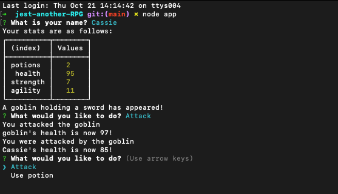

# Jest Another RPG
  
  ## Description
  This command line game uses constructor functions and random logic to simulate a battle between a player and a monster.

  
  ## Table of Contents
  * [Installation](#installation)
  * [Usage](#usage)
  * [License](#license)
  * [Contributing](#contributing)
  * [Tests](#tests)
  * [GitHub](#github)
  * [Credits](#credits)

  ## Installation
  Node.js and npm inquirer are required.

  ## Usage
  Just for fun.  
  

  ## License
    
  This project uses  the [MIT](https://opensource.org/licenses/MIT) license.

  ## Contributing
  This project uses the Contributor Covenant.  

  ## Tests
  See the __tests__ folder for tests used in the process of making this application.

  ## Questions
  Reach out via email or GitHub.  
  cassie.s.simpson@gmail.com  
  [cassie-s](https://github.com/cassie-s/)

  ## Credits
  This project was an online lesson by the University of Minnesota coding bootcamp. 

  

